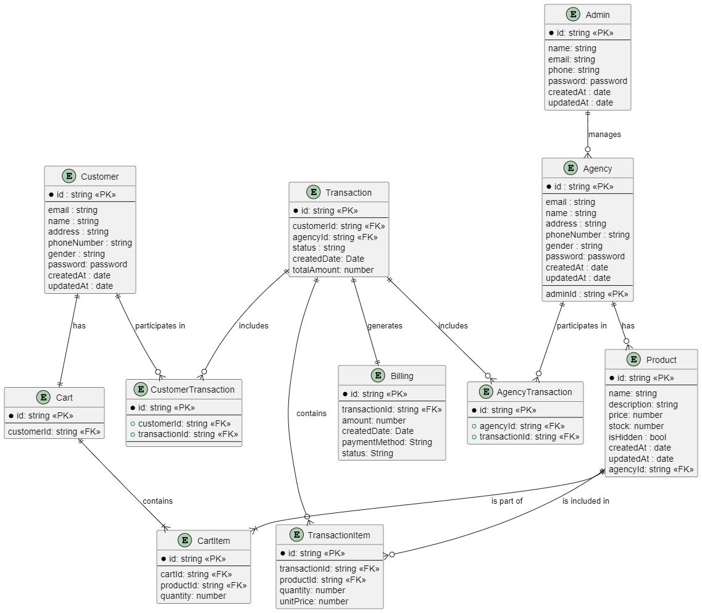
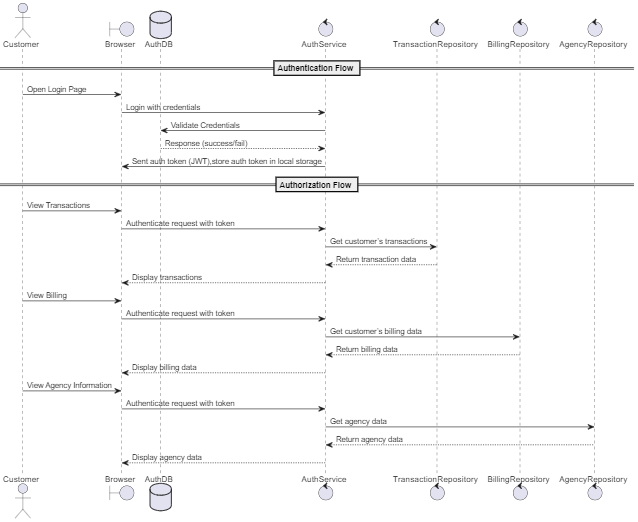
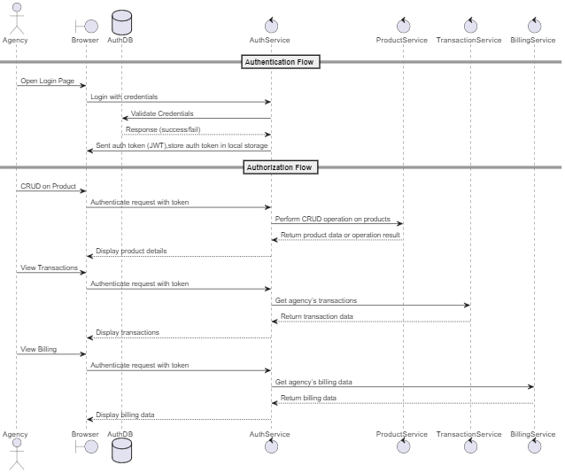
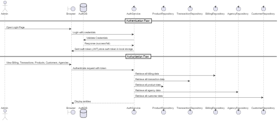
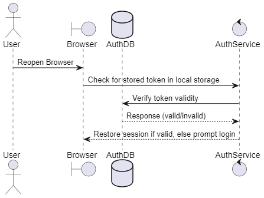

## UDT-BACKEND-NODEJS-TESTSHEET
### Installation
> - git clone https://github.com/manhcuongno3/UDT-BACKEND-NODEJS-TESTSHEET.git
> - cd UDT-BACKEND-NODEJS-TESTSHEET

### Question 1
> - cd question1
> - node rent-container-algorithm.js

### Question 2
> Diagram for ecosystem:
> 

### Question 3

1. Database sẽ sử dụng: PostgreSQL
Sử dụng Redis cache để tối ưu hóa các tác vụ hay sử dụng.

2. Lý do chọn PostgreSQL: 
Bởi vì PostgreSQL là relational database, hỗ trợ foreign keys, relationships, indexing và transactions. Nếu sử dụng NoSQL, 
cần phải thay đổi các schema để tương thích

Điểm mạnh:
 - Toàn vẹn dữ liệu : Tham chiếu qua khóa ngoại để xử lý các relationships phức tạp.
 - Sử dụng SQL để truy vấn và cập nhật dữ liệu nhanh. Giúp các tác vụ phân tích báo cáo của agency và admin được tối ưu hóa.
 - Tuân thủ ACID(Atomicity, Consistency, Isolation, Durability), đảm bảo các transaction có độ tin cậy cao
 - Dữ liệu nhất quán: Tránh trùng lặp hoặc thừa dữ liệu ở các schema khi lưu vào database.
 - Bảo mật: Cung cấp kiểm soát dữ liệu dựa trên các quyền.

Điểm yếu: 
 - Learning Curve: Với các tác vụ như crud đơn giản các bản ghi thì không khó để làm được tuy nhiên với các tính năng nâng cao, phức tạp, tối ưu hóa 
 hiệu suất dựa trên thiết kế truy vấn đòi hỏi có mức độ hiểu biết sâu và nhiều kinh nghiệm.
 - Cấu hình phức tạp, yêu cầu các thiết lập để có thể triển khai và bảo trì.
 - Hạn chế mở rộng: Nếu hệ thống e-commerce lớn với hàng triệu bản ghi, PostgreSQL không có sharding tự dộng để phân tán dữ liệu qua nhiều máy 
 chủ (horizontal scaling). Cần phải cài đặt thủ công hoặc biện pháp bên ngoài.
 - Hiệu suất: PostgreSQL sử dụng MVCC (Multi-Version Concurrency Control) để quản lý tính đồng thời. Khi một bản ghi được cập nhật, PostgreSQL sẽ tạo
 một bản ghi mới và giữ lại bản ghi cũ. Dẫn đến kích thước tăng nhanh. Các dữ liệu này cần được xử lý thường xuyên.

3. docker-compose.yml file để chạy các database dưới local:
> - default username and password is admin
> - default database name is ecommerce
> - Start by steps:
> - Run docker desktop
> - cd question3
> - docker compose up __or__ docker compose up -d POSTGRES_USER=your username POSTGRES_PASSWORD=your password POSTGRES_DB=your database name

4. Set up Loopback 4
> - git checkout feature/setup-loopback
> - cd ecommerce
> - npm install
> - npm start

5. Write API for feature for diagram
> - git checkout feature/ecommerce-api
> - cd ecommerce
> - start database in docker
> - migrate application with database by command: npm run migrate
> - npm install
> - npm start 

6. Test API
> - access to http://localhost:3000/explorer

### Question 4
Diagram for authentication and authorize:
#### Customer Sequence Diagram

#### Agency Sequence Diagram
  

#### Admin Sequence Diagram

#### Persistent Authentication Sequence Diagram

